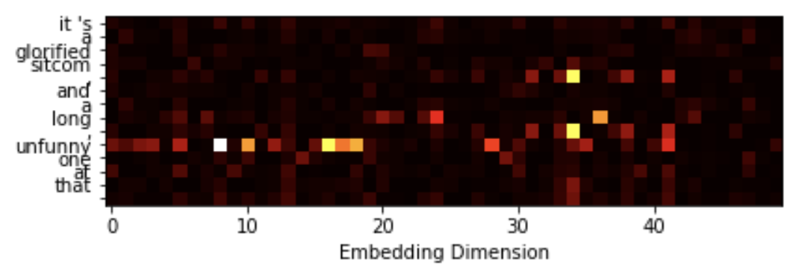

# Explaining-CNN-text-classification


In this repo we show how a CNN model, with a given input can be explained. The CNN model used in this repo is a pytorch implementation of [1]. The model is first trained on the polarity dataset[2] and then explained via an adverserial attack [3] on the word embeddings.



### How to run
``` 
# install required packages
conda env create -f exp_text.yml

# run 
python exp_text.py -no-cuda -snapshot snapshot/best_steps_1900.pt -example_save_path tmp_saved_data/ -predict_and_attack "it's a glorified sitcom , and a long , unfunny one at that ."
```


## References
<a id="1">[1]</a> 
Kim, Yoon (2014). 
Convolutional Neural Networks for Sentence Classification.
EMNLP, 11(3), 1746-1751.

<a id="2">[2]</a> 
Bo Pang, Lillian Lee, and Shivakumar Vaithyanathan (2002).
Thumbs up? Sentiment Classification using Machine Learning Techniques
EMNLP 2002.

<a id="3">[3]</a> 
Arash Rahnama, Andrew Tseng (2021).
An Adversarial Approach for Explaining the Predictions of Deep Neural Networks
CVPR Workshops, 2021, pp. 3253-3262.